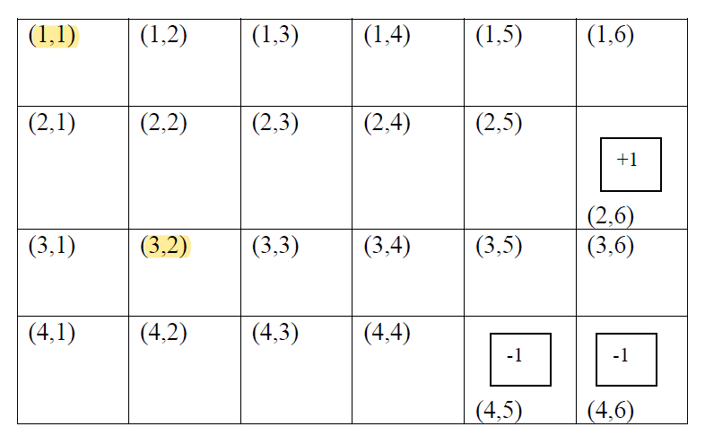
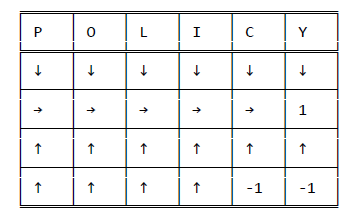
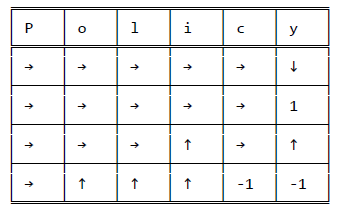
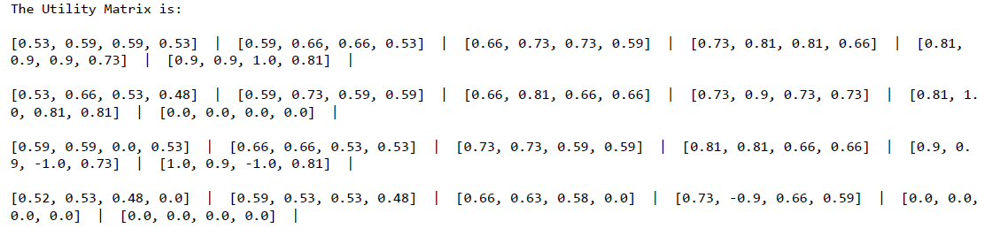

# Reinforcement Learning Using Q-Learning and Adaptive Dynamic Programming

The problem involves using two reinforcement learning methods: Adaptive Dynamic Programming (ADP) with value iteration and Q-learning with value iterations on possible actions. The initial values of the states are set to 0, and these values are optimized to develop the optimal policy for the robot to navigate the mini-world. The resulting policies from both methods are compared, and any discrepancies between them are analyzed and explained. The solution involves representing the optimal policy with directional arrows, indicating the recommended direction for the robot to travel from any given state to reach the terminal state with the maximum reward.

Mini World

Policy for the Mini World using ADP technique

  

Policy for the Mini World using the Q-Learning technique

  

Utility Matrix from the learning 

  

